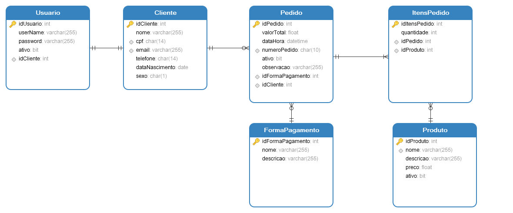

## API de delivery

### DER

### Funcionalidades

**Questão 01:** A empresa deseja acompanhar o faturamento em períodos específicos. Para isso, você deve desenvolver uma funcionalidade no PedidoService que retorne o faturamento total em um intervalo de datas, considerando apenas os pedidos não cancelados.
Tarefa:
1) Crie um método no PedidoService que receba duas datas (dataInicial e dataFinal) como parâmetros.
2) Calcule o faturamento total somando o valorTotal dos pedidos dentro desse período.
3) Garanta que apenas pedidos não cancelados (status ativo) sejam considerados no cálculo.

**Questão 02:**   A empresa deseja implementar um controle de promoções para incentivar as vendas. Para isso, você deve desenvolver uma funcionalidade no PedidoService que aplique um desconto ao pedido caso ele atenda a determinados critérios.
Tarefa:
1) Crie um método no PedidoService que aplique um desconto ao pedido caso o valor total seja superior a R$ 500,00.
2) O desconto deve seguir a seguinte regra:
- Pedidos entre R$ 500,00 e R$ 1.000,00 → 5% de desconto
- Pedidos acima de R$ 1.000,00 → 10% de desconto
3) Garanta que apenas pedidos não cancelados possam receber descontos.

**Leia também:** [README do Frontend](./frontend/README.md)